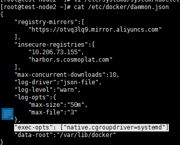
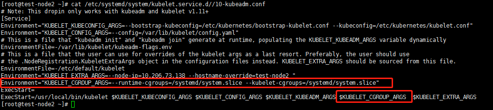

# k8s遇到kubelet日志中PLEG问题的解决方案

- 升级内核
- 升级systemd
- 解决cgroup问题
- 解决hostnamectl无法使用的问题

---

## 1、升级内核

### 1.1 更新yum仓库

#### 1.1.1 替换阿里云yum源，并升级

```shell
wget -O /etc/yum.repos.d/CentOS-Base.repo http://mirrors.aliyun.com/repo/Centos-7.repo

yum clean all && yum -y update
```

#### 1.1.2 启用elrepo仓库

```shell
rpm --import https://www.elrepo.org/RPM-GPG-KEY-elrepo.org

rpm -Uvh http://www.elrepo.org/elrepo-release-7.0-3.el7.elrepo.noarch.rpm
```

### 1.2 升级内核

#### 1.2.1 安装最新版本内核

```shell
yum --enablerepo=elrepo-kernel install kernel-lt-devel kernel-lt -y
```

### 1.3 查看现有内核启动顺序

```shell
awk -F\' '$1=="menuentry " {print $2}' /etc/grub2.cfg
```

### 1.4 修改默认启动项

#### 1.4.1 查看内核启动序号

```shell
awk -F\' '$1=="menuentry " {print $2}' /etc/grub2.cfg

CentOS Linux (4.4.179-1.el7.elrepo.x86_64) 7 (Core)
CentOS Linux (3.10.0-693.el7.x86_64) 7 (Core)
CentOS Linux (0-rescue-6d4c599606814867814f1a8eec7bfd1e) 7 (Core)
```

如果上述步骤报错如下:

```shell
[root@tcosmo-sh05 ~]# awk -F\' '$1=="menuentry " {print $2}' /etc/grub2.cfg
awk: fatal: cannot open file `/etc/grub2.cfg' for reading (No such file or directory)
```

那么需要执行[下述命令](https://blog.csdn.net/qq_26129413/article/details/120136942):
```shell
grub2-mkconfig -o /boot/grub2/grub.cfg
```

#### 1.4.2 设置启动序号

xxx 为序号数字，以指定启动列表中第x项为启动项，x从0开始计数

```shell
grub2-set-default xxxx
```

> 例如设置以4.4内核启动
>
> 则直接输入“grub2-set-default 0”，下次启动即可从4.4启动

```shell
grub2-set-default 0
```

### 1.5 重启

#### 1.5.1 重启系统

```shell
reboot
```

#### 1.5.2 检查内核版本

```shell
uname -r
```

#### 1.5.3 安装工具

```shell
yum -y install ipvsadm socat conntrack
```

## 2、升级systemd

查看版本:
```shell
systemctl --version
```

升级:
```shell
# wget https://copr.fedorainfracloud.org/coprs/jsynacek/systemd-backports-for-centos-7/repo/epel-7/jsynacek-systemd-backports-for-centos-7-epel-7.repo -O /etc/yum.repos.d/jsynacek-systemd-centos-7.repo
# yum update systemd -y
```

## 3、修改docker、kubelet配置以解决cgroup问题

上述步骤完成后, 等重启就都生效，对每个节点做如下改动.

### 3.1 修改docker配置

在`/etc/docker/daemon.json`中添加配置:

```shell
"exec-opts": ["native.cgroupdriver=systemd"]
```

如下图所示:



### 3.2 修改kubelet配置

在`/etc/systemd/system/kubelet.service.d/10-kubeadm.conf`中加入配置:

```shell
Environment="KUBELET_CGROUP_ARGS=--runtime-cgroups=/systemd/system.slice --kubelet-cgroups=/systemd/system.slice"
```

其中一行添加参数`$KUBELET_CGROUP_ARGS`:

如下图所示:



## 4、升级内核后`hostnamectl`无法使用的解决方案

需要执行如下步骤:

### 4.1 SELinux设置permissive工作模式

```shell
setenforce 0
```
### 4.2 注释`/usr/lib/systemd/system/systemd-hostnamed.service`中Protect, Private为yes的行

### 4.3 加载配置文件

```shell
systemctl daemon-reload
```

### 4.4 重启systemd-hostnamed

```shell
systemctl restart systemd-hostnamed
```

### 4.5 重启systemd-resolved

```shell
systemctl restart  systemd-resolved
```
